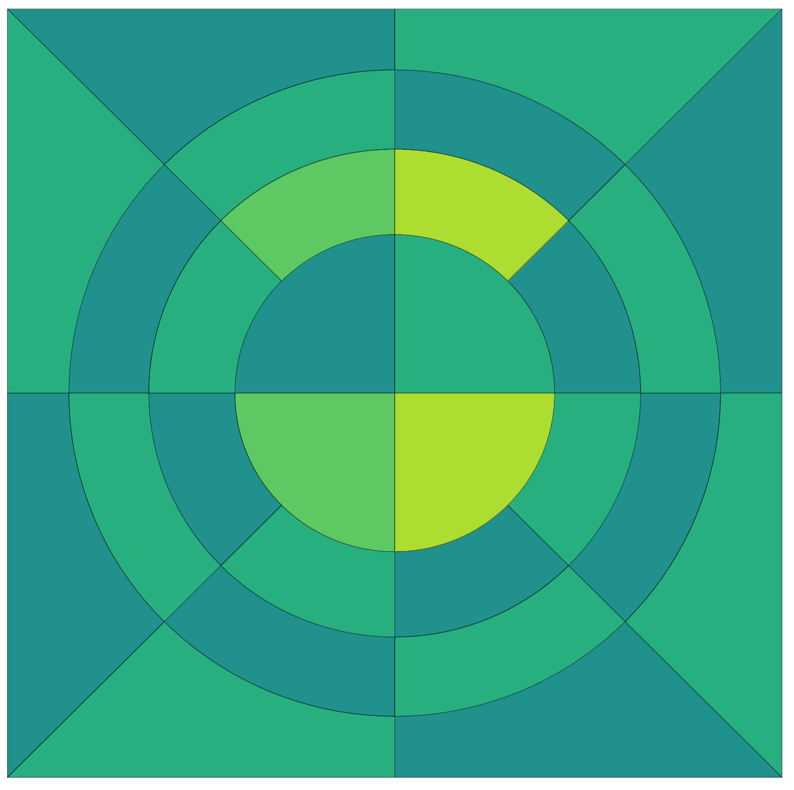

# NURBS Mesh creator for pincell arrays

This program will generate an MFEM NURBS mesh for an array of pincells,
such as those typically found in a PWR reactor.
Each pincell type can have a unique number of rings and materials.

MFEM mesh files can intended to be used by the MFEM finite element library.
https://mfem.org/

The mesh files can be visualized in GLVIS.
https://glvis.org/

The mesh files can also be visualized in Visit, but they will not show the midpoints or rounded edges.


## Compiling the Code

To build the code, a fortran compiler must be installed.
The command "gfortran" must be part of your path.

```
  cd src
  make
  cd ..
```

This will create an executable file called "driver.exe".


## Running Sample cases

Several sample cases are found in the "samples" directory.
The input should be self-evident.

To run a case from the samples directory:
```
  cd samples
  ../src/driver.exe [file.inp]
```

This will create an MFEM NURBS mesh file called "file.mesh"

The mesh file can be used by MFEM.

Use the program "glvis" to view the mesh file.

Sample image "pin2b"

